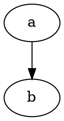
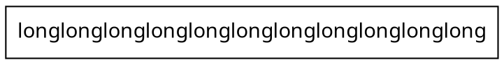
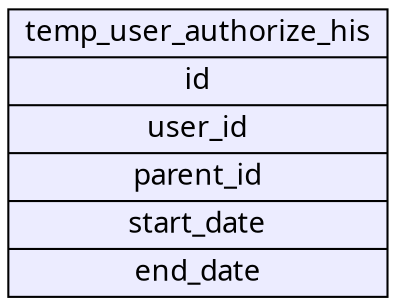

```dot
digraph {
a -> b
}
```

```dot
digraph {
node[fontname="Source Code Pro ExtraLight"]
A[shape=record,label="longlonglonglonglonglonglonglonglonglonglong"]

}

```

```dot
digraph {
node[shape=record,style=filled,fillcolor="gray",color="#666"]
node[fontname="Trebuchet MS"]
rankdir = LR
H[label="temp_user_authorize_his | id | <user_id>user_id | parent_id | start_date | end_date",fillcolor="#ECECFF"]
}
```
